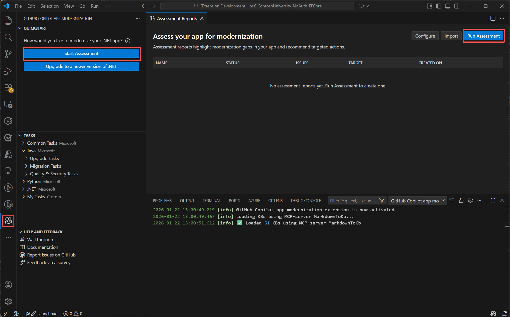
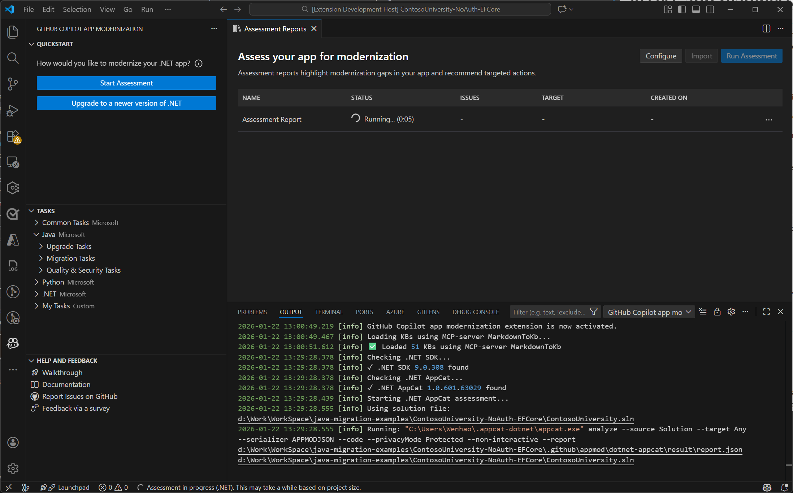
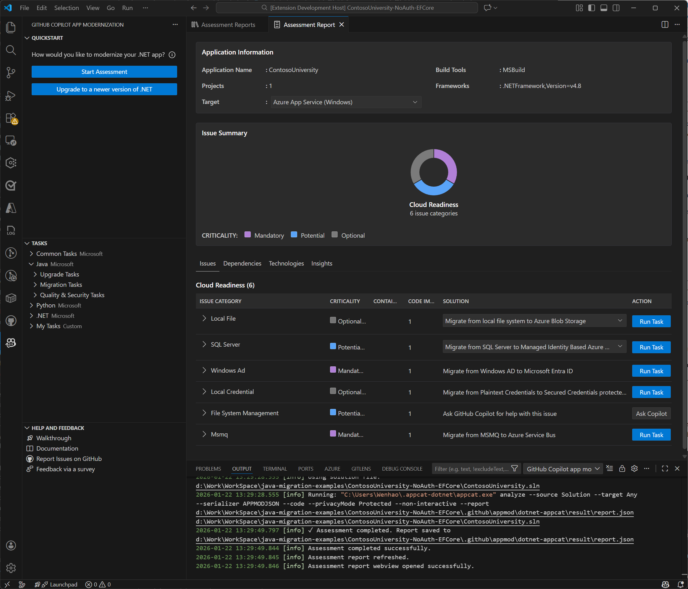

# Exercise 01 — Setup, Install, and Assess the .NET Project

**Duration**: 15 minutes
**Copilot Feature**: GitHub Copilot Modernization for .NET — Assessment
**Goal**: Install the GitHub Copilot modernization extension, clone the sample project, and run an automated assessment to identify all migration readiness challenges.

---

## Background

GitHub Copilot modernization for .NET starts with an **assessment phase** that analyzes your application's dependencies, configuration, and architecture for migration readiness. Rather than jumping straight into code changes, the assessment surfaces all migration challenges upfront — showing their impact level and recommending specific migration tasks ranked by priority.

This gives you a complete picture of the migration scope before a single line of code changes. The assessment uses the `AppModernization-DotNet` custom agent and is the foundation for everything in the .NET track.

---

## Step 1 — Install the Extension

1. Open VS Code Extensions view (`Ctrl+Shift+X`)
2. Search for **GitHub Copilot modernization**
3. Install the extension published by Microsoft (`vscjava.migrate-java-to-azure`)
4. **Restart VS Code** after installation
5. Install the package `dotnet tool install -g dotnet-appcat` from the terminal to enable the assessment feature. Restart the terminal after installation.

> **Tip**: Sign in to GitHub with an active Copilot subscription before this step. Any plan (Free, Pro, Business, Enterprise) works.

---

## Step 2 — Clone the Sample .NET Project

Copy and paste the following prompt into the chat:

```
Clone the dotnet migration copilot samples repository and open the
Contoso University solution in VS Code:

  git clone https://github.com/Azure-Samples/dotnet-migration-copilot-samples
```

In VS Code, open the **Contoso University** solution folder from the cloned repository.

---

## Step 3 — Open the GitHub Copilot Modernization Extension

1. In the VS Code Activity Bar, locate and click the **GitHub Copilot modernization** extension icon
2. The extension panel opens showing the **QUICKSTART** section

---

## Step 4 — Run the Assessment

1. In the QUICKSTART section, click **Start Assessment**



2. Click **Run Assessment** in the upper-right corner of the Assessment reports page
3. The assessment automatically analyzes the project for migration readiness

> **Tip**: If you have the `dotnet-appcat` tool installed, you can also run the assessment from the terminal with the below command and then load the report in the extension with the "Import" button.

Run the below command from the terminal in the project directory to start the assessment:

```cmd
appcat analyze contosoUniversity.sln --target any --serializer APPMODJSON --code --privacyMode Protected --non-interactive --report .\.github\appmod\assessment\reports\report-contoso\report.json
```



4. When the assessment completes, a comprehensive report and list of migration tasks appear



The report shows:
- Migration challenge areas with impact level (High / Medium / Low)
- Prioritized list of migration tasks with recommended Azure targets
- Links to Azure service documentation for each migration task

> **Note**: The assessment may take several minutes to complete, especially on larger projects. It’s doing a deep analysis of your codebase and dependencies to identify all migration challenges.


---

## Verify

- [ ] GitHub Copilot modernization extension is installed and VS Code was restarted
- [ ] Contoso University solution is open in VS Code
- [ ] Assessment completed and the Assessment Report page is visible
- [ ] At least one migration task appears in the chat window with a recommended Azure target

---

## Key Takeaway

> The assessment is your migration roadmap — it transforms hours of manual discovery into a prioritized, actionable task list before writing a single line of migration code.

---

**Next**: [Exercise 02 — Chat-Based Migration with the AppModernization-DotNet Agent](exercise-02-chat-based-migration.md)
