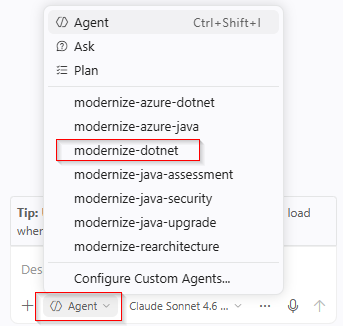

# Exercise 02 — Chat-Based Migration with the Modernize-DotNet Agent

**Duration**: 10 minutes
**Copilot Feature**: Modernize-DotNet Custom Agent
**Goal**: Select the Modernize-DotNet custom agent and start a migration using a natural language prompt.

---

## Background

GitHub Copilot modernization for .NET exposes a **custom agent** called `Modernize-DotNet` that is specifically optimized for .NET-to-Azure migration scenarios. Unlike general Copilot chat, this agent has deep, built-in knowledge of:
- Azure service equivalents for common .NET dependencies (e.g., RabbitMQ → Azure Service Bus, SQL Server → Azure SQL)
- Microsoft best practices for .NET-to-Azure migrations
- Predefined migration tasks for the most common enterprise scenarios

The agent uses **Claude Sonnet 4.5** by default for best results. It orchestrates the full migration lifecycle — planning, code changes, validation, and summary — from a single natural language prompt.

---

## Step 1 — Open Copilot Chat and Select the Custom Agent

1. Click the **chat icon** in the VS Code Activity Bar to open the Copilot chat window
2. Locate the **agent selector dropdown** at the top of the chat input box
3. Select **Modernize-DotNet** from the list



> **Tip**: If `Modernize-DotNet` does not appear, confirm the GitHub Copilot modernization extension is installed and VS Code was fully restarted.

---

## Step 2 — Enter the Migration Prompt

Copy and paste the following prompt into the chat:

```
migrate from rabbitmq to Azure service bus
```

Or choose a scenario matching the Contoso University project:

```
migrate from SQL Server to Azure SQL Database
```

> **Tip**: Always use the format `migrate from <source> to <target>` — this pattern triggers the agent's full migration workflow.

---

## Step 3 — Approve MCP Tool Use

The agent may request permission to use knowledge base tools in the **Model Context Protocol (MCP) server** to access Azure documentation.

1. When prompted, review the tool access request
2. Click **Allow** or **Continue** to grant permission
3. MCP tool access is required for the agent to follow current Azure SDK patterns accurately

---

## Step 4 — Monitor the Agent Starting the Migration

The `Modernize-DotNet` agent will:
1. Analyze your code for the source technology
2. Create `plan.md` in `.github/appmod/code-migration/<branch-name>/`
3. Begin planning code, dependency, and configuration changes

At each step, click **Continue** to proceed and **Keep** to accept changes.

---

## Verify

- [ ] `Modernize-DotNet` agent is selected in the chat agent dropdown
- [ ] Migration prompt was entered and the agent began analyzing the project
- [ ] MCP tool permissions were granted when prompted
- [ ] `plan.md` creation started (visible in VS Code Explorer)

---

## Key Takeaway

> The `Modernize-DotNet` custom agent turns a complex multi-step Azure migration into a single natural language prompt — you direct the migration, Copilot executes it end-to-end.

---

**Next**: [Exercise 03 — Plan and Progress Tracker](exercise-03-plan-and-progress.md)
