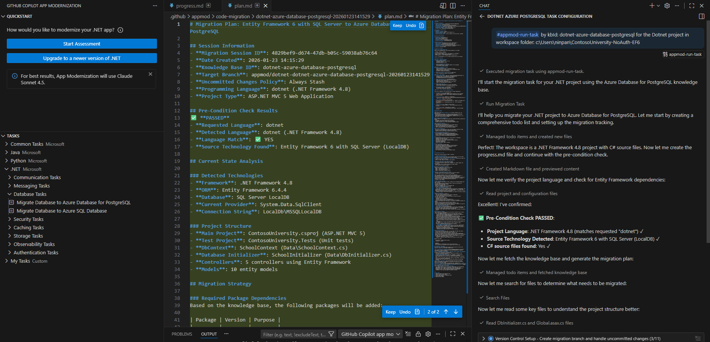

# Exercise 03 — Plan and Progress Tracker

**Duration**: 10 minutes
**Copilot Feature**: GitHub Copilot Modernization — Migration Plan and Progress Tracking
**Goal**: Review and customize the generated `plan.md` and understand `progress.md` before allowing Copilot to begin code remediation.

---

## Background

When GitHub Copilot modernization for .NET starts a migration, it immediately creates two files in a dedicated folder inside your workspace:

```
.github/appmod/code-migration/<target-branch-name>/
├── plan.md       — The overall migration plan
└── progress.md   — A live progress tracker updated as Copilot works
```

The `plan.md` file is your **migration contract** — it specifies exactly what Copilot will change, which Azure services replace existing components, and in what order tasks execute. You can edit this file before proceeding. The `progress.md` acts as a live task board, updated in real time as Copilot completes each step.

This "plan before execute" pattern is a key Copilot Agent Mode capability — you always see the full scope before any code is changed.

---

## Step 1 — Locate and Open `plan.md`

Navigate to:

```
.github/appmod/code-migration/<branch-name>/plan.md
```

Open it in VS Code Markdown Preview (`Ctrl+Shift+V`).



---

## Step 2 — Review the Migration Plan Contents

Verify the plan includes these sections:

| Section | What to Check |
|---------|---------------|
| Source technology | Matches what you're migrating FROM (e.g., RabbitMQ, SQL Server) |
| Target Azure service | Matches your intended target (e.g., Azure Service Bus, Azure SQL) |
| Code change tasks | Lists specific files and patterns to be updated |
| Dependency changes | Shows NuGet packages to add/remove |
| Configuration changes | Lists config keys and connection string updates |

---

## Step 3 — Customize the Plan

Copy and paste the following prompt into the chat to have Copilot explain and review the plan:

```
Review the plan.md file for this migration. Explain each task in the plan and
identify any high-risk changes I should be aware of before proceeding.
```

Edit `plan.md` directly in VS Code if needed:
- Remove a task that does not apply to your project
- Add a note for a specific file that requires special handling
- Reorder tasks if a different execution sequence is preferable

---

## Step 4 — Open `progress.md`

Open `progress.md` in the same folder. It tracks each task's state:
- `[ ]` = Not yet started
- `[x]` = Completed

You will monitor this file throughout Exercise 04 to follow the remediation as it happens.

---

## Verify

- [ ] `plan.md` exists under `.github/appmod/code-migration/`
- [ ] `progress.md` exists in the same folder
- [ ] All migration tasks in `plan.md` are reviewed and understood
- [ ] Source/target mapping in the plan matches your intended migration
- [ ] Plan was customized if needed before proceeding

---

## Key Takeaway

> Reviewing and editing `plan.md` before remediation begins is the most important control point in the migration — it is your last chance to shape exactly what Copilot will change.

---

**Next**: [Exercise 04 — Code Remediation](exercise-04-code-remediation.md)
