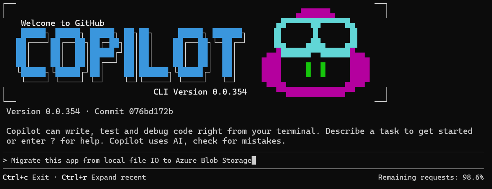
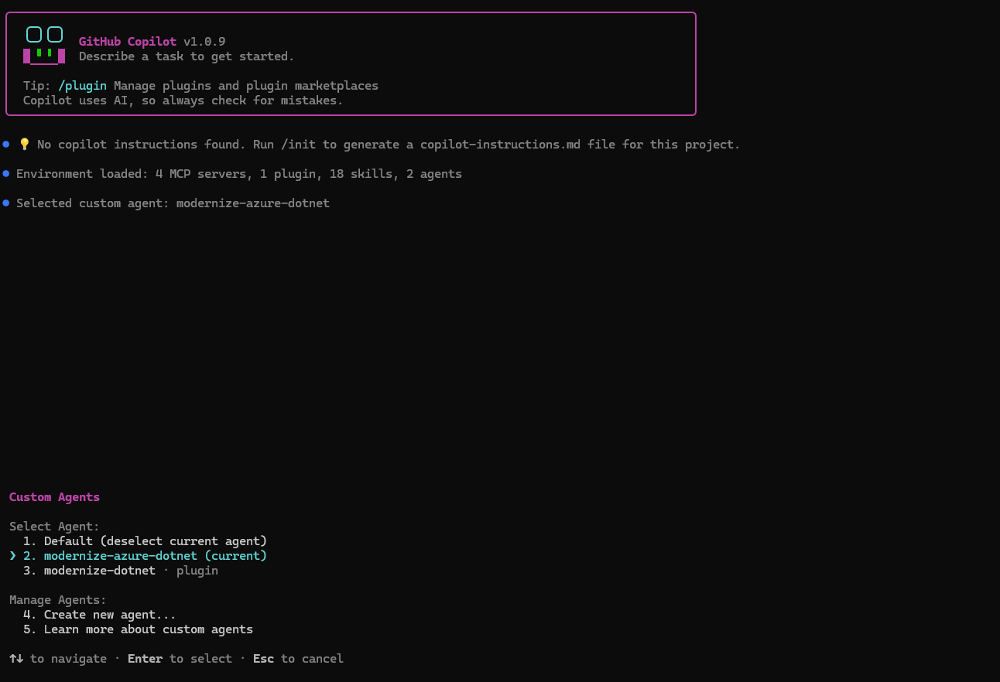
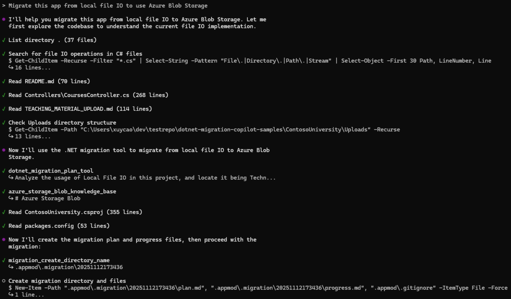
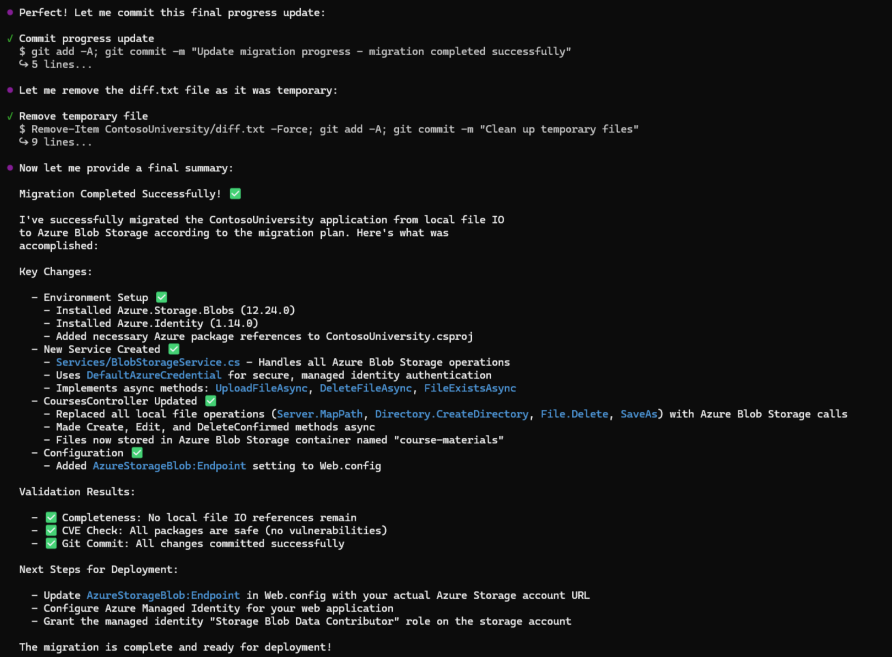

# Exercise 06 — Migrate .NET to Azure Using Copilot CLI *(Optional)*

**Duration**: 15 minutes
**Copilot Feature**: GitHub Copilot CLI + Custom Agent (`modernize-azure-dotnet`)
**Goal**: Configure the Copilot CLI with the .NET migration MCP server and custom agent, then run the same Contoso University migration entirely from the terminal — no IDE required.

---

## Background

Everything you did in Exercises 01–05 through VS Code can also be done from the **terminal** using [Copilot CLI](https://docs.github.com/en/copilot/how-tos/use-copilot-agents/use-copilot-cli). This is valuable for CI/CD pipelines, remote/headless environments, or developers who prefer a terminal-first workflow.

The Copilot CLI exposes the same `AppModernization-DotNet` capabilities through a locally registered **custom agent** (`modernize-azure-dotnet`) backed by the **DotNetAppModMcpServer-migrate** MCP server. Plan/progress files are written to `.appmod/.migration/` instead of `.github/appmod/`.

> **Requirement**: GitHub Copilot Pro, Pro+, Business, or Enterprise plan. Organization admins must enable the Copilot CLI policy.

---

## Step 1 — Start Copilot CLI in the Project Folder

```bash
cd dotnet-migration-copilot-samples/ContosoUniversity
copilot
```



When prompted about directory trust:
- Select **Yes, proceed** for a single session
- Select **Yes, and remember this folder** to persist trust

---

## Step 2 — Add the .NET Migration MCP Server

In the Copilot CLI prompt, run:

```
/mcp add DotNetAppModMcpServer-migrate
```

Fill in the fields exactly as follows:

| Field | Value |
|-------|-------|
| Server Type | `Local` |
| Command | `dnx Microsoft.AppModernization.McpServer.DotNet.Migration --yes --source https://api.nuget.org/v3/index.json` |
| Environment Variables | *(leave empty)* |
| Tools | `*` |

Verify the server was registered:
```
/mcp show
```

> **Tip**: Alternatively, edit `~/.copilot/mcp-config.json` directly. See [./references/dotnet-cli.md](../../.github/skills/appmodernizationworkshopskill/references/dotnet-cli.md) for the full JSON config.

---

## Step 3 — Create the Custom Agent File

Create the file `~/.copilot/agents/modernize-azure-dotnet.agent.md`.

Copy and paste the following prompt into the chat to have Copilot create the agent file for you:

```
Create the file ~/.copilot/agents/modernize-azure-dotnet.agent.md with this
exact content:

---
name: modernize-azure-dotnet
description: Expert assistant for modernizing .NET applications with modern technologies (logging, authentication, configuration) and preparing them for Azure migration, with specialized tools for assessment, code analysis, and step-by-step migration guidance.
---

# .NET modernize to azure assistant

I am a specialized AI assistant for modernizing .NET applications and preparing them for Azure.

## What I Can Do
- Migration: structured migrations for logging, auth, config, data access
- Validation: builds, tests, CVE checks, consistency/completeness verification
- Tracking: plan.md and progress.md in .appmod/.migration/
- Azure Preparation: cloud-native code patterns

## CRITICAL: Migration Workflow
1. Planning: call dotnet_migration_plan_tool FIRST (mandatory)
2. Execute phases: Analysis > Dependencies > Configuration > Code > Verification
3. Verification steps (never skip): dotnet msbuild, check_cve_vulnerability,
   migration_consistency, migration_completeness, dotnet test
4. Write migration summary at completion
```

---

## Step 4 — Run the Migration from Copilot CLI

Select the agent using `/agent` and pick `modernize-azure-dotnet`:



Copy and paste the following prompt into the chat:

```
Use the dotnet modernization agent to migrate this app from local SQL Server
to Azure SQL Database with managed identity
```

Copilot CLI runs the migration and shows live progress in the terminal:



Continue clicking **Continue** (or pressing Enter) at each approval gate.

When complete, the migration summary is shown:



---

## Step 5 — Confirm Plan and Progress Files

Check the files created by the CLI agent:

```bash
ls .appmod/.migration/
# Expected: plan.md  progress.md
```

> **VS Code vs CLI file locations**:
> - VS Code: `.github/appmod/code-migration/<branch>/plan.md`
> - CLI: `.appmod/.migration/plan.md`

---

## Verify

- [ ] Copilot CLI started successfully in the Contoso University project folder
- [ ] `DotNetAppModMcpServer-migrate` MCP server added and visible in `/mcp show`
- [ ] `~/.copilot/agents/modernize-azure-dotnet.agent.md` exists with correct content
- [ ] Migration prompt ran and progress was visible in the terminal
- [ ] `plan.md` and `progress.md` exist under `.appmod/.migration/`
- [ ] Migration summary was generated at completion

---

## Key Takeaway

> Copilot CLI brings the full .NET modernization workflow to the terminal — the same MCP tools, custom agent logic, and 5-step validation apply, making it suitable for CI/CD automation and environments where VS Code is unavailable.

---

**Next (Optional)**: [Exercise 07 — Migrate .NET Using the Copilot Cloud Agent *(Enterprise)*](exercise-07-coding-agent.md)

Or explore:
- [Predefined .NET Migration Tasks](https://learn.microsoft.com/en-us/dotnet/azure/migration/appmod/predefined-tasks)
- [GitHub Copilot CLI documentation](https://docs.github.com/en/copilot/how-tos/copilot-cli/use-copilot-cli-agents/overview)
