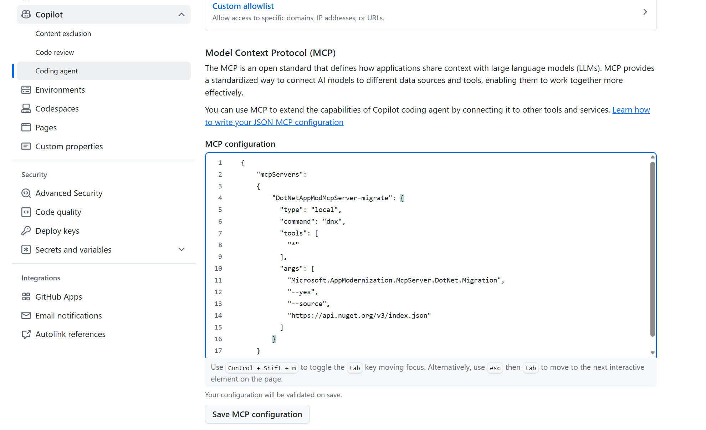
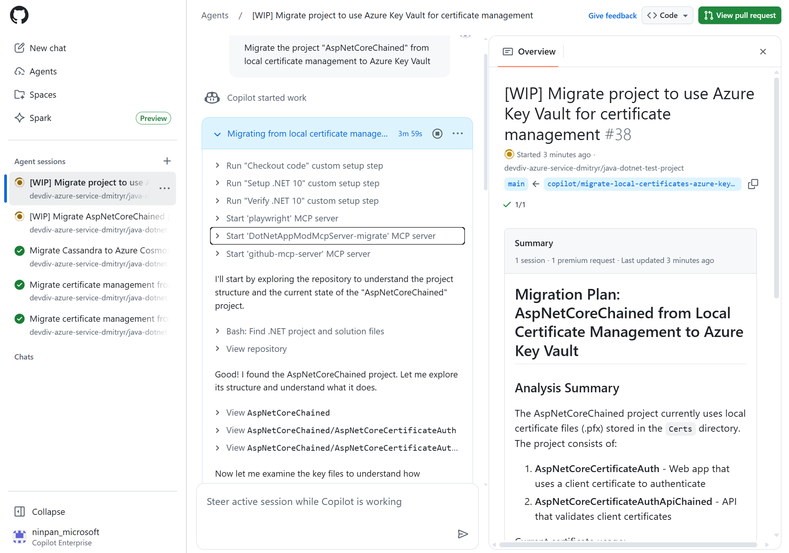
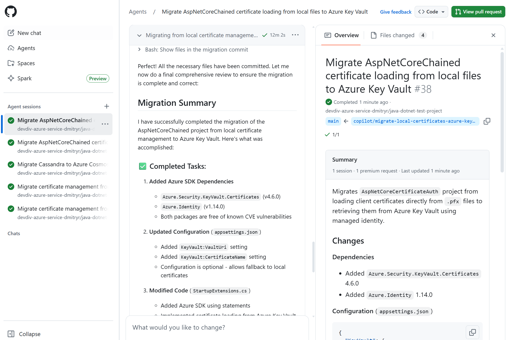

# Exercise 07 — Migrate .NET to Azure Using the Copilot Cloud Agent *(Optional — Enterprise)*

**Duration**: 15 minutes
**Copilot Feature**: GitHub Copilot Cloud Agent + MCP (`DotNetAppModMcpServer-migrate`)
**Goal**: Configure the Copilot Cloud Agent in your repository, create the `modernize-azure-dotnet` custom agent profile, then delegate a .NET Azure migration entirely to the agent — it works autonomously in the cloud and opens a pull request when done.

---

## Background

The [Copilot Cloud Agent](https://docs.github.com/en/copilot/concepts/agents/coding-agent/about-coding-agent) takes the .NET modernization workflow beyond VS Code and the terminal: the agent runs **entirely in the cloud**, completing migration tasks autonomously like a human developer. You describe the migration, the agent executes the full pipeline — plan, code transformation, build verification, CVE checks, consistency/completeness validation — and opens a pull request for your review.

This unlocks unattended migrations for teams working across multiple repositories, integration into GitHub-based workflows without local tooling, and the ability to delegate large migrations during off-hours.

> ⚠️ **Enterprise/Org Requirement**: Copilot Cloud Agent must be **enabled per repository** by a repository **administrator** via **Settings → Copilot → Cloud Agent**. Available with GitHub Copilot Pro, Pro+, Business, and Enterprise plans. Not available for managed user account repositories or where explicitly disabled.
> **Additional requirement**: A Copilot environment with the **.NET 10 SDK** installed (configured via `copilot-setup-steps.yml`).

---

## Step 1 — Set Up the .NET 10 SDK Environment

The Coding Agent needs the .NET 10 SDK available in its cloud environment. Create or update `.github/workflows/copilot-setup-steps.yml` in your repository:

```yaml
- name: Set up .NET 10
  uses: actions/setup-dotnet@v5
  with:
    dotnet-version: '10.x'

- name: Verify .NET 10
  run: |
    dotnet --info
```

Commit and merge this file into the default branch before proceeding.

> **Tip**: See [Customize the agent environment](https://docs.github.com/en/copilot/how-tos/use-copilot-agents/coding-agent/customize-the-agent-environment) for full details on the setup steps file.

---

## Step 2 — Configure the MCP Server in Repository Settings

> **Admin access required** for this step.

1. In your GitHub repository, go to **Settings**
2. Select **Copilot**, then select **Cloud Agent**
3. Under **MCP Configuration**, paste the following JSON and select **Save Configuration**:

```json
{
  "mcpServers": {
    "DotNetAppModMcpServer-migrate": {
      "type": "local",
      "command": "dnx",
      "tools": [
        "*"
      ],
      "args": [
        "Microsoft.AppModernization.McpServer.DotNet.Migration",
        "--yes",
        "--source",
        "https://api.nuget.org/v3/index.json"
      ]
    }
  }
}
```

<!-- TODO: Add screenshot dotnet-coding-agent-mcp.png to assets/dotnet/ -->


4. *(Optional)* Set any required environment variables under **Environment → Copilot** in settings. These initialize automatically on the first agentic task invocation.
5. Select **Save Configuration**.

---

## Step 3 — Create the Custom Agent Profile

The custom agent defines the migration workflow the Coding Agent will follow.

1. Go to the agents tab at **https://github.com/copilot/agents**
2. Open the dropdown in the prompt box and select your **target repository**
3. *(Optional)* Select the branch (default: main)
4. Select the Copilot icon → **+ Create an agent** — this creates `my-agent.agent.md` in `.github/agents/`
5. Replace the template content with the following, then **rename the file to `modernize-azure-dotnet.agent.md`**:

```
---
name: modernize-azure-dotnet
description: Expert assistant for modernizing .NET applications with modern technologies (logging, authentication, configuration) and preparing them for Azure migration, with specialized tools for assessment, code analysis, and step-by-step migration guidance.
---

# .NET modernize to azure assistant

I am a specialized AI assistant for modernizing .NET applications and preparing them for Azure.

## What I Can Do
- Migration: structured migrations for logging, auth, config, data access
- Validation: builds, tests, CVE checks, consistency/completeness verification
- Tracking: plan.md and progress.md in .appmod/.migration/
- Azure Preparation: cloud-native code patterns

## CRITICAL: Migration Workflow
1. Planning: call dotnet_migration_plan_tool FIRST (mandatory)
2. Execute phases: Analysis > Dependencies > Configuration > Code > Verification
3. Verification steps (never skip):
   - Build: dotnet msbuild
   - CVE: check_cve_vulnerability
   - Consistency: migration_consistency
   - Completeness: migration_completeness
   - Tests: dotnet test
4. Write migration summary at completion

## Core Principles
- Always call tools in real-time, never reuse previous results
- Follow plan.md and progress.md strictly
- Never skip verification steps
- Track all changes in Git commits
```

6. Commit the file and merge it into the default branch
7. Return to the agents tab and refresh — your custom agent appears in the dropdown

> For more details, see [Create a custom agent profile](https://docs.github.com/en/copilot/how-tos/use-copilot-agents/coding-agent/create-custom-agents#creating-a-custom-agent-profile-in-a-repository-on-github).

---

## Step 4 — Run the Migration via the Agents Panel

1. Open the **Agents panel** at https://github.com/copilot/agents
2. Select your **target repository** and select the **`modernize-azure-dotnet`** custom agent from the dropdown
3. Copy and paste one of the following migration prompts:

```
Migrate this project from local file I/O to Azure Blob Storage
```

Or for a database migration:

```
Migrate this project from local SQL Server to Azure SQL Database with managed identity
```

Or for observability:

```
Migrate this project from file-based logging to OpenTelemetry
```

<!-- TODO: Add screenshot dotnet-coding-agent-select.png to assets/dotnet/ -->
.png)

After submitting the prompt:
- Copilot starts a **new session** and opens a **new pull request** in your repository
- The PR appears in the list below the prompt box
- Copilot works autonomously — you are **added as a reviewer** on the PR when done (triggering a notification)

> **All predefined .NET migration scenarios**: See [.NET predefined migration tasks](https://learn.microsoft.com/en-us/dotnet/azure/migration/appmod/predefined-tasks).

---

## Step 5 — Monitor Progress and Review Results

Monitor migration progress in the Agents panel:

<!-- TODO: Add screenshot dotnet-coding-agent-progress.png to assets/dotnet/ -->

  
Review the migration summary when complete:

<!-- TODO: Add screenshot dotnet-coding-agent-completion.png to assets/dotnet/ -->


Open the pull request in your repository and:
1. Review the **Files Changed** tab — inspect dependency changes, code transformations, config migrations
2. Check `.appmod/.migration/plan.md` and `progress.md` committed to the PR branch for the full audit trail
3. Verify the PR description contains the migration summary
4. If satisfied, merge the PR

Copy and paste the following prompt to ask the agent to summarize what it did:

```
Summarize the migration completed in this pull request: what Azure services
replaced which on-premises components, what files were changed, what CVEs
were fixed, and what validation steps passed.
```

---

## Step 6 — (Optional) Deploy to Azure

After migration, deploy directly from the Agents panel with the same custom agent:

```
Deploy this application to Azure
```

Follow the same workflow — a PR is opened with all infrastructure and deployment configuration changes.

---

## Verify

- [ ] `.github/workflows/copilot-setup-steps.yml` exists with .NET 10 SDK setup steps
- [ ] MCP server (`DotNetAppModMcpServer-migrate`) is saved in repository Settings → Copilot → Cloud Agent
- [ ] `modernize-azure-dotnet.agent.md` exists in `.github/agents/` and appears in the agent dropdown
- [ ] Migration prompt submitted and a new pull request was created by Copilot
- [ ] PR includes code changes, updated NuGet dependencies, and CVE fixes
- [ ] `.appmod/.migration/plan.md` and `progress.md` are committed to the PR branch
- [ ] You were added as a reviewer on the PR with a notification
- [ ] All 5 validation steps (build, CVE, consistency, completeness, tests) are noted in the PR
- [ ] *(Optional)* Deploy PR created if deployment was attempted

---

## Key Takeaway

> The Copilot Coding Agent fully automates the .NET modernization pipeline in the cloud — you delegate a plain-language migration task, and the agent handles planning, code transformation, 5-step validation, and PR creation autonomously, enabling unattended migrations at scale.

---

<!-- Instructor Guide: This exercise requires repository admin access to configure the MCP server and .NET 10 SDK setup. If participants don't have admin rights, use this as a demo exercise comparing the coding agent PR output with the VS Code migration from Exercise 02–05. Key distinction from CLI: the agent file lives in .github/agents/ (in the repo), not ~/.copilot/agents/ (local). -->

**.NET track complete.** For next steps, explore:
- [All .NET predefined migration tasks](https://learn.microsoft.com/en-us/dotnet/azure/migration/appmod/predefined-tasks)
- [Using GitHub Copilot Cloud Agent](https://docs.github.com/en/copilot/how-tos/use-copilot-agents)
- [Provide feedback](https://aka.ms/ghcp-appmod/feedback)
