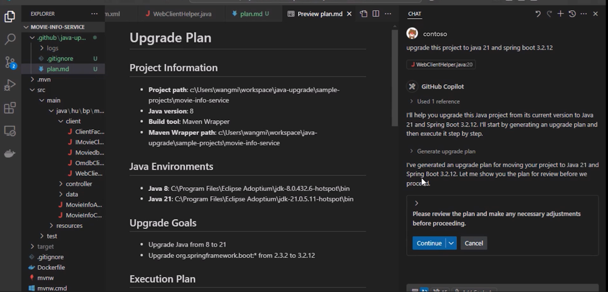
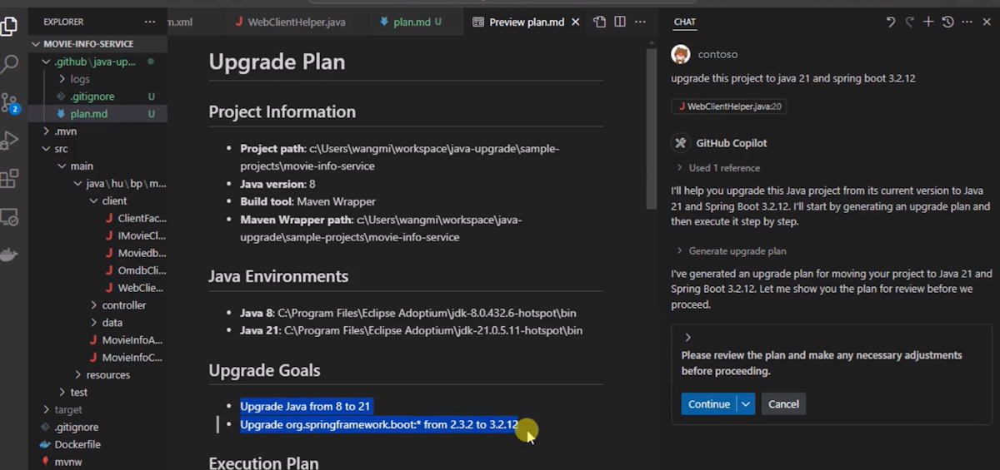

# Exercise 02 — Launch Agent Mode and Generate the Upgrade Plan

**Duration**: 10 minutes
**Copilot Feature**: Copilot Agent Mode / GitHub Copilot Modernization
**Goal**: Use Copilot Agent Mode to analyze the Java project and generate a structured upgrade plan in `plan.md`.

---

## Background

GitHub Copilot Agent Mode is a specialized mode where Copilot operates autonomously — calling tools, running commands, and iterating on results rather than just responding to single prompts. The GitHub Copilot modernization extension exposes "Java upgrade tools" that Agent Mode leverages to scan your project's JDK version, build configuration, and dependency tree.

The output is a `plan.md` file that lists the source/target JDK versions and every framework/library upgrade path Copilot will apply. Reviewing this plan before proceeding gives you full control over what gets changed. This is the critical decision gate before any code is modified.

---

## Step 1 — Switch to Agent Mode

1. Ensure the cloned Java project from Exercise 01 is open in VS Code
2. Open the GitHub Copilot Chat panel (`Ctrl+Alt+I`)
3. In the chat input, click the **mode selector** dropdown (defaults to "Ask")
4. Select **Agent** to switch to Agent Mode

---

## Step 2 — Enter the Upgrade Prompt

Copy and paste the following prompt into the chat:

```
Upgrade project to Java 21 and Spring Boot 3.2 using Java upgrade tools
```

> **Tip**: For a JDK-only upgrade without framework changes, use:
> `Upgrade project to Java 21 using Java upgrade tools`

When Copilot prompts **"Continue to generate an upgrade plan"**, click **Continue**.

---

## Step 3 — Review the Generated `plan.md`

Copilot analyzes the project and creates a `plan.md` file in the workspace root. Open it and verify:

1. **Source JDK version** matches your project's current JDK (e.g., Java 8 or 11)
2. **Target JDK version** is Java 21
3. **Framework upgrade paths** list Spring Boot and Spring Framework versions correctly
4. No unexpected dependencies are included



---

## Step 4 — Edit the Plan and Proceed

If any target is incorrect, edit `plan.md` directly in VS Code before proceeding. When the plan is correct, select **Continue** in the Copilot chat to accept the plan and move to the code transformation phase.



> **Tip**: Ensure the plan reflects your actual upgrade targets — e.g., Java 8 → Java 21, Spring Boot 2.7 → 3.2. Mismatched targets here will cause issues in later exercises.

---

## Verify

- [ ] Agent Mode is active in the Copilot Chat panel
- [ ] `plan.md` was created in the project workspace root
- [ ] Source and target JDK versions in `plan.md` are correct
- [ ] Framework upgrade paths are reviewed and accurate
- [ ] **Continue** was selected to proceed past the plan

---

## Key Takeaway

> The upgrade plan in `plan.md` is your contract with Copilot — reviewing it before proceeding ensures no unintended changes are applied to your project.

---

**Next**: [Exercise 03 — Apply Code Changes with OpenRewrite](exercise-03-apply-code-changes.md)
