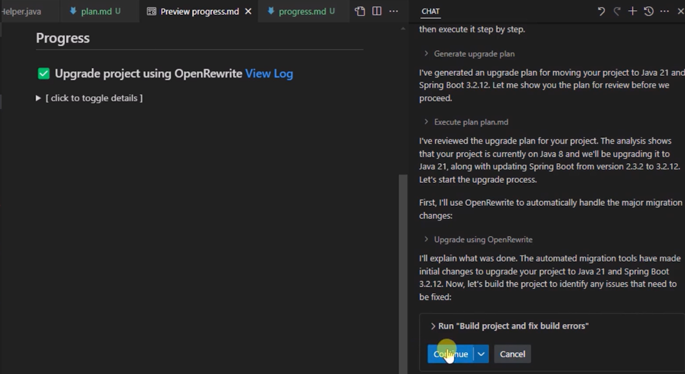

# Exercise 03 — Apply Code Changes with OpenRewrite

**Duration**: 15 minutes
**Copilot Feature**: GitHub Copilot Agent Mode / OpenRewrite Integration
**Goal**: Trigger the OpenRewrite transformation and the AI-driven build/fix loop to upgrade the Java code automatically.

---

## Background

GitHub Copilot modernization uses a two-phase code change approach. The first phase uses **OpenRewrite** — an open-source automated refactoring tool — to apply deterministic, recipe-based transformations such as renaming deprecated APIs, updating import statements, and changing configuration syntaxes. OpenRewrite works at the AST (Abstract Syntax Tree) level, so changes are syntactically safe.

The second phase runs an AI-driven **build/fix loop** where Copilot iteratively compiles the project, identifies errors, and applies targeted fixes until the build succeeds. You can monitor progress through the `progress.md` file that Copilot maintains in real time.

---

## Step 1 — Confirm the OpenRewrite Transformation

After accepting the upgrade plan (Exercise 02), Copilot prompts you to begin the OpenRewrite phase.

When you see: **"Confirm the OpenRewrite transformation"**

1. Review what Copilot describes it will change
2. Click **Continue to upgrade Java code using OpenRewrite**
3. Wait for the transformation to complete — this may take 2–5 minutes depending on project size

> **Tip**: You do not need to intervene during OpenRewrite. Copilot handles the full transformation automatically.

---

## Step 2 — Approve the Dynamic Build/Fix Loop

Once OpenRewrite finishes, Copilot begins the AI-driven fix loop.

When you see: **"Approve the dynamic build/fix loop"**

1. Click **Continue to build the project and fix errors**
2. Copilot compiles the project, detects remaining errors (removed APIs, changed method signatures), and applies AI-generated fixes
3. The loop repeats automatically until the project builds successfully



---

## Step 3 — Monitor Progress in `progress.md`

At any point during the fix loop, open `progress.md` in VS Code to see:
- Completed transformation steps
- Current build error count
- Latest fix applied

Copy and paste the following prompt into the chat to get a status update:

```
What is the current status of the Java upgrade? How many build errors remain
and what is the latest fix being applied?
```

---

## Step 4 — Wait for Build Success

The loop continues until the project builds with zero errors. You will see a confirmation in the chat when the build succeeds.

> **Important**: Do not close VS Code or interrupt the Copilot session during the build/fix loop. If Copilot pauses and waits, click **Continue** to resume.

---

## Verify

- [ ] OpenRewrite transformation was confirmed and completed without errors
- [ ] Build/fix loop was approved and started
- [ ] `progress.md` exists in the workspace and shows active progress
- [ ] Project build eventually succeeds with 0 compilation errors

---

## Key Takeaway

> Combining OpenRewrite's deterministic recipe-based transforms with Copilot's AI-driven build/fix loop eliminates the majority of manual migration work while keeping you in full control at every approval gate.

---

**Next**: [Exercise 04 — CVE and Code Behavior Validation](exercise-04-cve-and-behavior-checks.md)
