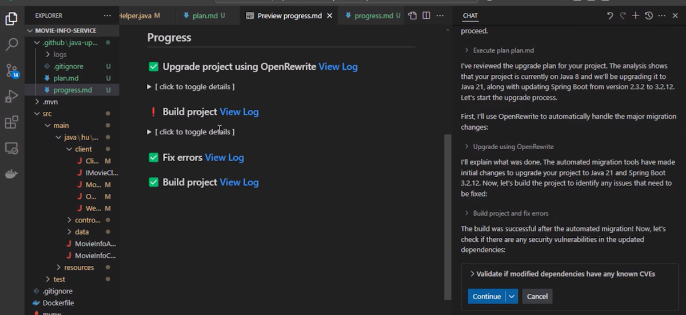
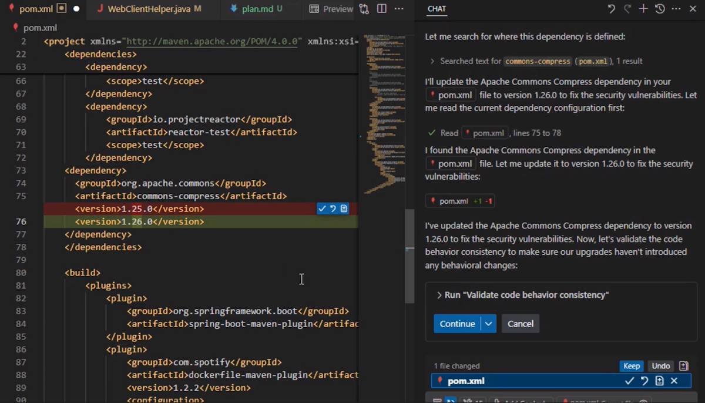

# Exercise 04 — CVE and Code Behavior Validation

**Duration**: 10 minutes
**Copilot Feature**: GitHub Copilot Agent Mode — Security and Consistency Validation
**Goal**: Run CVE vulnerability checks and code behavior consistency analysis to ensure the upgraded project is secure and functionally equivalent to the original.

---

## Background

A successful build does not mean a safe or correct build. Upgrading dependencies can introduce libraries with known **Common Vulnerabilities and Exposures (CVEs)**, and some API changes during a major version upgrade can silently alter runtime behavior. GitHub Copilot modernization adds two automated validation steps after the build succeeds to catch precisely these issues.

The **CVE check** scans all modified and new dependencies against known vulnerability databases. The **code behavior consistency check** analyzes the upgraded code for logic changes that could cause different runtime outcomes compared to the original. Both checks are automated — your job is to review what Copilot finds and decide whether to keep the proposed fixes.

---

## Step 1 — Run the CVE Validation

After the build/fix loop completes (Exercise 03), Copilot prompts for the next validation.

When you see: **"Run Validate if any modified dependencies have known CVEs"**

1. Click **Continue**
2. Copilot scans all modified dependencies for CVE issues
3. If CVEs are found, Copilot Agent Mode automatically attempts to remediate them



For each proposed CVE fix, decide:
- **Accept**: Click **Continue** or **Keep** to apply the fix
- **Reject**: Manually revert in the editor if the fix is inappropriate for your project

---

## Step 2 — Run the Code Behavior Consistency Check

When you see: **"Run Validate code behavior consistency"**

1. Click **Continue**
2. Copilot analyzes the upgraded code for behavioral differences from the original
3. If issues are found, Copilot attempts to restore consistency



Review proposed changes and decide whether to keep or discard each one.

> **Tip**: After both checks, Copilot automatically rebuilds the project and reruns checks to confirm all issues are resolved before declaring the upgrade complete.

---

## Step 3 — Handle Remaining Minor Issues

Some low-severity issues that do not affect the build or runtime may remain. Copilot flags these in the final summary as "unaddressed minor CVE issues." These are informational — the upgrade is considered complete when the project builds and passes the main checks.

Copy and paste the following prompt into the chat to ask about remaining issues:

```
List any remaining CVE issues or code behavior inconsistencies that were not
automatically fixed, with their severity and recommended remediation steps.
```

---

## Verify

- [ ] CVE validation was run and all critical/high-severity CVEs were addressed
- [ ] Code behavior consistency check was completed
- [ ] Project rebuilt successfully after all validation checks
- [ ] Any unaddressed minor issues are noted, understood, and documented

---

## Key Takeaway

> Automated CVE and behavior consistency validation makes the upgrade production-safe — Copilot catches security regressions and behavioral drift that a standard build check would never detect.

---

**Next**: [Exercise 05 — Review the Upgrade Summary](exercise-05-review-summary.md)
