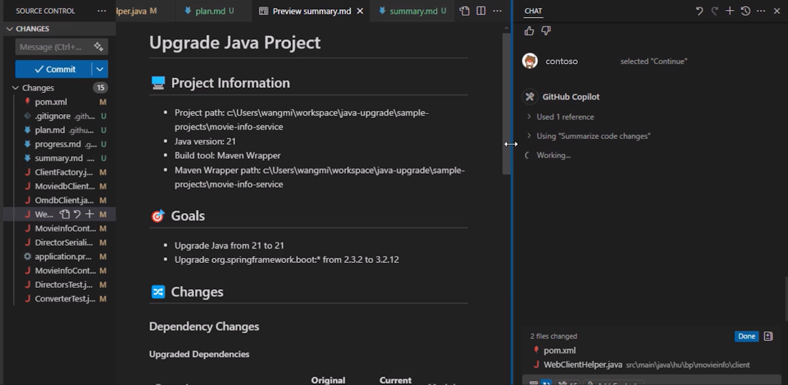

# Exercise 05 — Review the Upgrade Summary

**Duration**: 5 minutes
**Copilot Feature**: GitHub Copilot Modernization — Upgrade Summary Report
**Goal**: Inspect the generated `summary.md` to understand everything that changed during the Java upgrade and confirm the project is ready.

---

## Background

At the conclusion of every successful upgrade, GitHub Copilot modernization generates a `summary.md` file in the project workspace. This file is the audit trail of the entire upgrade — it records every dependency change, lines of code modified, security issues resolved, and any remaining items needing attention.

Understanding how to read this summary is essential for communicating upgrade outcomes to your team, passing compliance reviews, and identifying follow-up tasks. It is the single document that answers: "What exactly did Copilot change, and why?"

---

## Step 1 — Open and Review `summary.md`

1. In VS Code Explorer, locate `summary.md` in the project root
2. Open it in Markdown Preview (`Ctrl+Shift+V`)

The summary contains these sections:

| Section | What It Tells You |
|---------|-------------------|
| Project information | Project name, build tool, language version |
| Lines of code changed | Total files and lines modified |
| Updated dependencies | Before/after dependency versions |
| Summarized code changes | High-level description of structural changes |
| Fixed CVE issues | Security vulnerabilities resolved |
| Unaddressed minor CVEs | Low-severity issues flagged but not auto-fixed |



---

## Step 2 — Ask Copilot to Explain Key Changes

Copy and paste the following prompt into the chat:

```
Based on the summary.md file in this workspace, explain the most significant
code changes made during the Java upgrade. Highlight any breaking API changes
and what was done to address them.
```

---

## Step 3 — Confirm the Project Builds from CLI

1. Open a terminal in VS Code (`` Ctrl+` ``)
2. Run `mvn clean install` (or `gradle build`)
3. Confirm the build completes with no errors

This verifies the upgrade is not just complete in Copilot's view, but independently buildable.

---

## Verify

- [ ] `summary.md` exists and is readable in Markdown Preview
- [ ] Source and target JDK versions are clearly stated in the summary
- [ ] Updated dependency versions (before/after) are listed
- [ ] Fixed CVE issues section shows resolved security items
- [ ] Project builds successfully from the command line (`mvn clean install`)

---

## Key Takeaways

> The `summary.md` file is the single source of truth for the upgrade — it provides everything needed for peer review, compliance sign-off, and follow-up action planning.

---

<!-- Instructor Guide: Allow extra 5 min for participants to explore the summary.md in detail. Encourage them to compare lines of code changed with the actual diff in VS Code Source Control. -->

> **Mandatory track complete.** Continue to the optional exercises:

**Next (Optional)**: [Exercise 06 — Upgrade Java Using Copilot CLI & Custom Agent](exercise-06-copilot-cli-migration.md)
