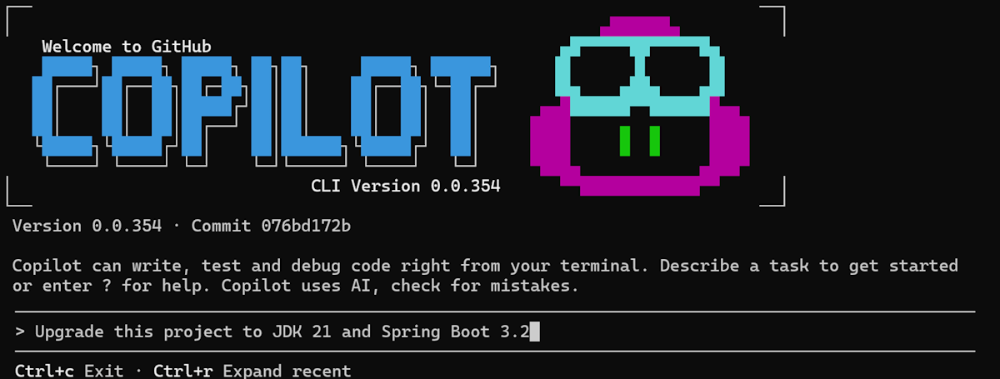
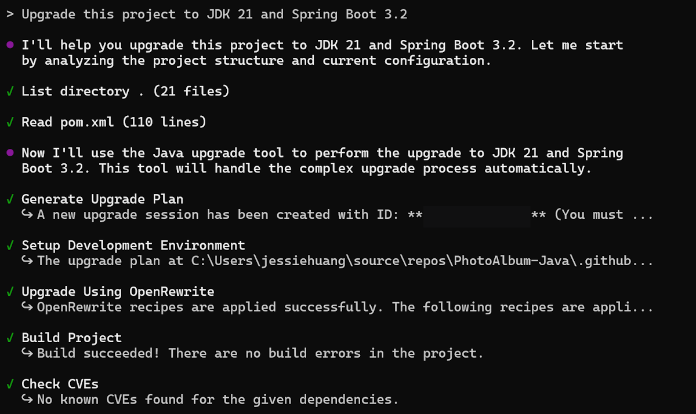
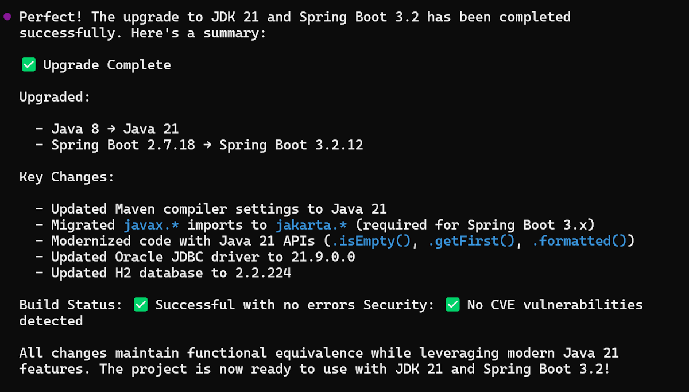
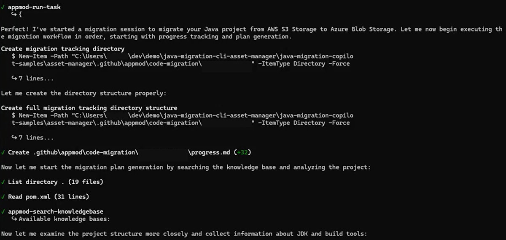
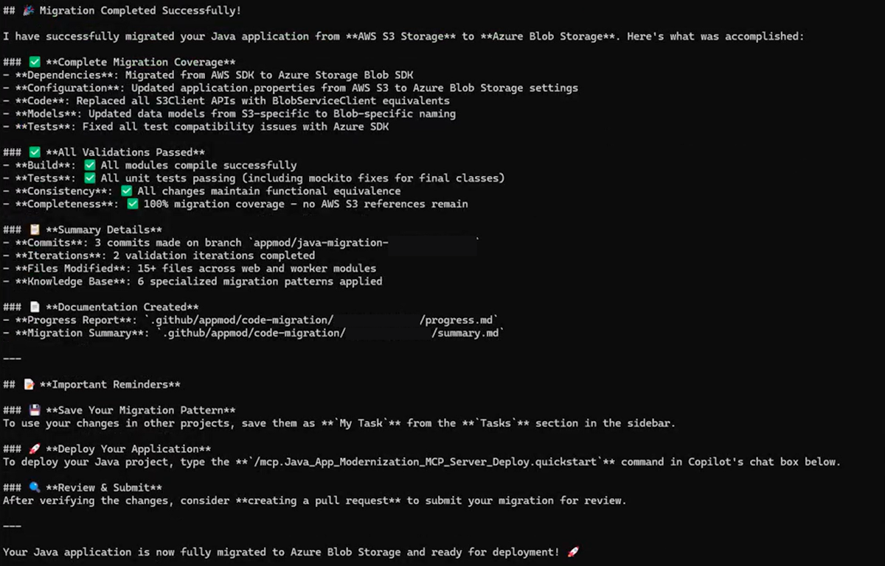
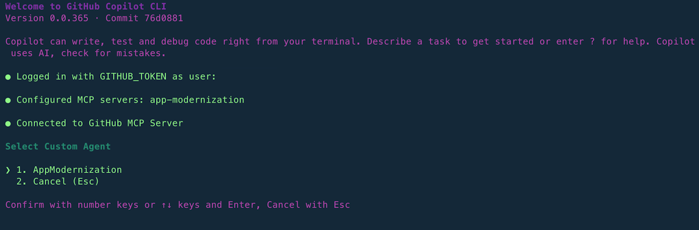

# Exercise 06 — Upgrade Java Using Copilot CLI & Custom Agent *(Optional)*

**Duration**: 15 minutes
**Copilot Feature**: GitHub Copilot CLI + Custom Agent (`AppModernization`)
**Goal**: Configure the Copilot CLI with the Java modernization MCP server and custom agent, then run the same JDK/Spring Boot upgrade entirely from the terminal — no IDE required.

---

## Background

Everything you did in Exercises 01–05 through VS Code can also be done from the **terminal** using [Copilot CLI](https://docs.github.com/en/copilot/how-tos/use-copilot-agents/use-copilot-cli). This is valuable for CI/CD pipelines, remote/headless environments, or developers who prefer a terminal-first workflow.

The Copilot CLI exposes the same GitHub Copilot modernization capabilities through the **`app-modernization` MCP server** and an optional **custom agent** (`appmod-java.agent.md`). The upgrade workflow — plan generation, code remediation, build/fix loop, CVE validation, and summary — runs entirely in the terminal.

> **Requirement**: GitHub Copilot Pro, Pro+, Business, or Enterprise plan. Organization admins must enable the Copilot CLI policy.
> **Repo compatibility**: Works with any Java project (Maven or Gradle). No specific sample repo required — use the Maven or Gradle samples from Exercise 01, or your own Java project.

---

## Step 1 — Start Copilot CLI in the Project Folder

Open a terminal, navigate to your Java project root, and start Copilot CLI:

```bash
cd uportal-messaging      # or your Java project folder
copilot
```

<!-- TODO: Add screenshot cli-entrance.png to assets/java/ -->


When prompted about directory trust, select:
- **Yes, proceed** — Trust for this session only
- **Yes, and remember this folder** — Trust permanently (choose only for known-safe locations)

---

## Step 2 — Add the Java Modernization MCP Server

In the Copilot CLI prompt, run:

```
/mcp add app-modernization
```

Fill in the fields exactly as follows:

| Field | Value |
|-------|-------|
| Server Type | `Local` |
| Command | `npx -y @microsoft/github-copilot-app-modernization-mcp-server` |
| Environment Variables | *(leave empty)* |
| Tools | `*` |

Verify the server was registered:

```
/mcp show
```

> **Tip**: Alternatively, edit `~/.copilot/mcp-config.json` directly with the following JSON:
>
> ```json
> {
>   "mcpServers": {
>     "app-modernization": {
>       "type": "local",
>       "command": "npx",
>       "tools": ["*"],
>       "args": ["-y", "@microsoft/github-copilot-app-modernization-mcp-server"]
>     }
>   }
> }
> ```

---

## Step 3 — Create the Custom Agent File

Create the file `~/.copilot/agents/appmod-java.agent.md`.

Copy and paste the following prompt into the Copilot CLI chat to have Copilot create the agent file for you:

```
Create the file ~/.copilot/agents/appmod-java.agent.md with this exact content:

---
name: AppModernization
description: Modernize the Java application
tools: ['shell', 'read', 'edit', 'search', 'custom-agent', 'web', 'todo', 'app-modernization/*']
---

# Modernization agent instructions

## Your Role
- You are a highly sophisticated automated coding agent with expert-level knowledge
  in Java, popular Java frameworks, and Azure.
- You will help users migrate Java projects using the migration workflow defined below.

## Boundaries
- DO make changes directly to code files.
- DO directly execute your plan and update the progress.
- DO NOT seek approval/confirmation before making changes.

## Scope
- DO collect the framework and build environment (JDK, Maven/Gradle)
- DO replace original technology dependencies with equivalents
- DO update configuration files necessary for compilation
- DO fix any introduced CVEs during migration
- DO build with #build_java_project and run tests with #run_tests_for_java
- NEVER use terminal commands for build, test, or version control
  — use #build_java_project, #run_tests_for_java, #appmod-version-control

## Success Criteria
- No CVEs introduced, codebase compiles, unit tests pass
- All dependencies and imports replaced
- Plan generated, progress tracked, summary generated
```

Verify the file was created:

```bash
cat ~/.copilot/agents/appmod-java.agent.md
```

---

## Step 4 — Run the JDK/Spring Boot Upgrade (Mandatory)

Select the custom agent using `/agent` in the CLI and pick `AppModernization`, then copy and paste the following prompt:

```
Upgrade this project to JDK 21 and Spring Boot 3.2
```

The agent executes end-to-end:
1. Generates an upgrade plan (`plan.md`)
2. Performs code remediation
3. Runs the build/fix loop (up to 10 rounds)
4. Validates CVEs and code behavior consistency
5. Produces an upgrade summary (`summary.md`)

<!-- TODO: Add screenshot cli-upgrade-details.png to assets/java/ -->


Continue approving each step when prompted. When all checks pass, the upgrade summary is displayed:

<!-- TODO: Add screenshot cli-upgrade-summary.png to assets/java/ -->


---

## Step 5 — (Optional) Run an Azure Migration Task

If you want to also migrate the application to Azure, copy and paste the following prompt:

```
Migrate this application from S3 to Azure Blob Storage
```

<!-- TODO: Add screenshot cli-migrate-details.png to assets/java/ -->


When complete, the migration summary is displayed:

<!-- TODO: Add screenshot cli-migrate-summary.png to assets/java/ -->


> **All predefined migration scenarios**: See [Predefined tasks for GitHub Copilot modernization for Java](https://learn.microsoft.com/en-us/azure/developer/java/migration/migrate-github-copilot-app-modernization-for-java-predefined-tasks).

To select the agent explicitly instead of embedding it in the prompt:

```
/agent
```

Then pick `AppModernization` from the list, and describe your migration task.

<!-- TODO: Add screenshot cli-select-custom-agent.png to assets/java/ -->


---

## Verify

- [ ] Copilot CLI started successfully in the Java project folder
- [ ] `app-modernization` MCP server added and visible in `/mcp show`
- [ ] `~/.copilot/agents/appmod-java.agent.md` exists with correct agent content
- [ ] Upgrade prompt ran and progress was visible in the terminal
- [ ] Upgrade summary was generated at completion
- [ ] *(Optional)* Azure migration ran and migration summary was generated

---

## Key Takeaway

> Copilot CLI brings the full Java modernization workflow to the terminal — the same MCP tools, custom agent validation steps, and upgrade logic apply, making it ideal for CI/CD pipelines and environments where VS Code is unavailable.

---

<!-- Instructor Guide: Remind participants that Node.js 22+ and npm 10+ are required for the MCP server npx command. If participants don't have a Java project handy, the Maven sample (uportal-messaging) or Gradle sample (docraptor-java) from Exercise 01 work perfectly. The Azure migration step (Step 5) is purely optional — focus on the upgrade in Step 4. -->

**Next**: [Exercise 07 — Java Coding Agent *(Optional — Enterprise)*](exercise-07-coding-agent.md) or explore [Predefined Java Migration Tasks](https://learn.microsoft.com/en-us/azure/developer/java/migration/migrate-github-copilot-app-modernization-for-java-predefined-tasks) for all supported Azure migration scenarios.
