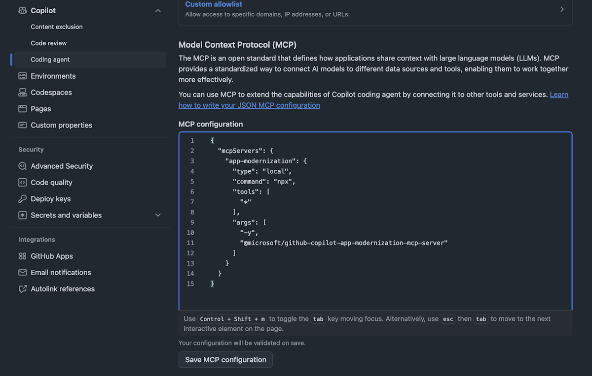
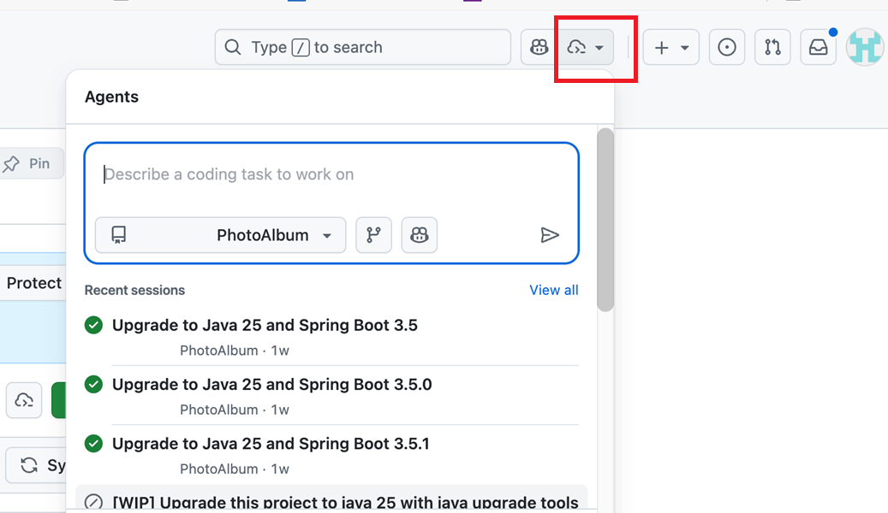
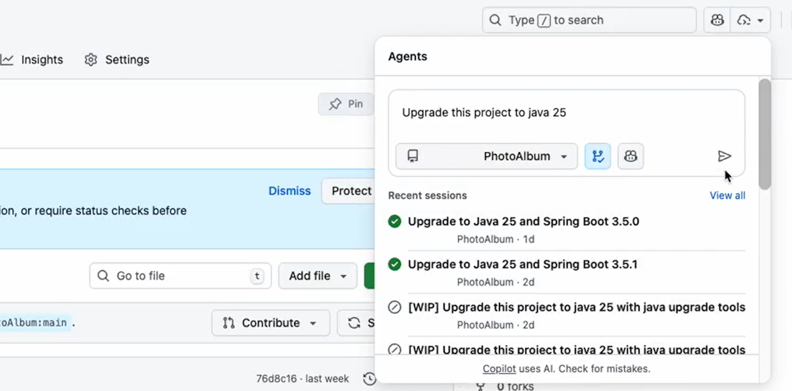
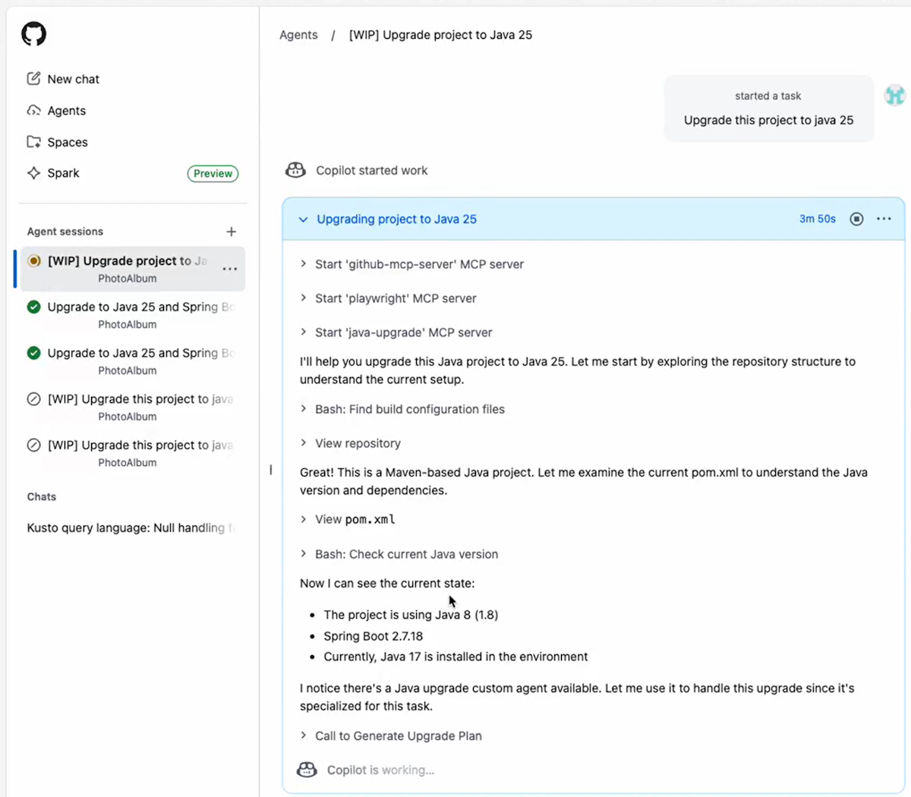
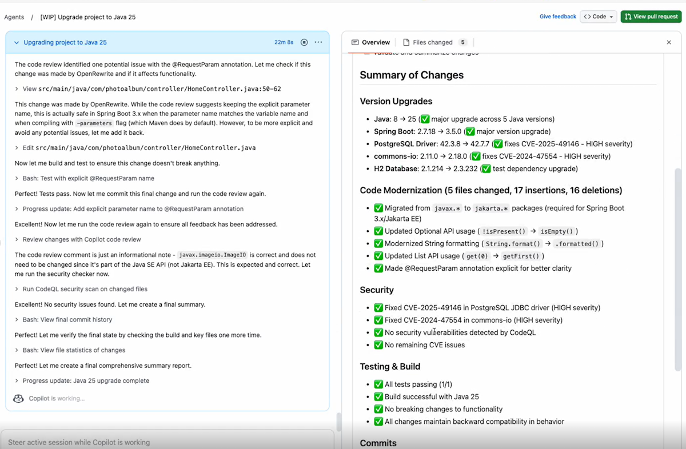
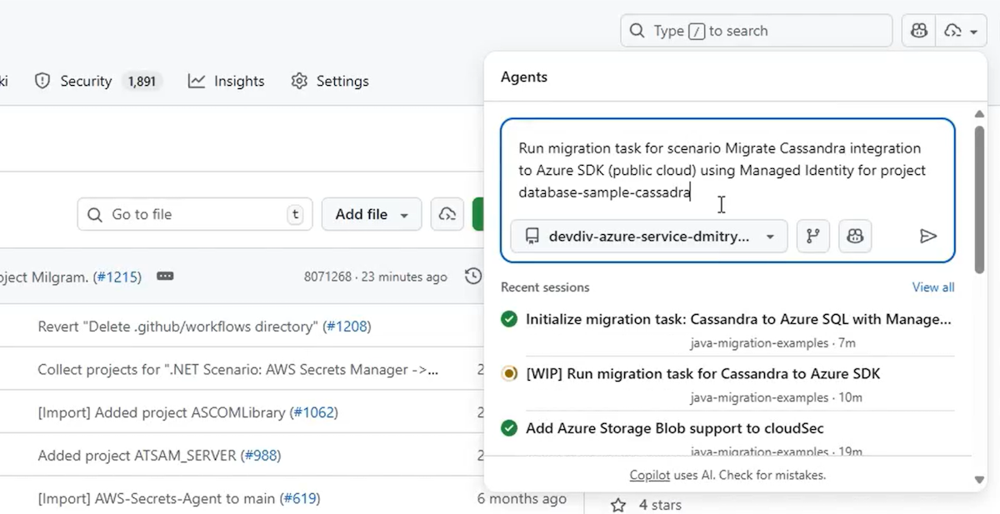
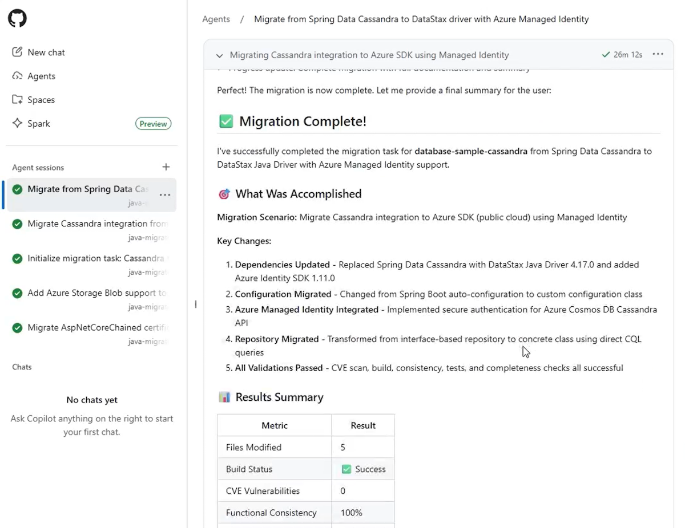

# Exercise 07 — Upgrade Java Using the Copilot Cloud Agent *(Optional — Enterprise)*

**Duration**: 15 minutes
**Copilot Feature**: GitHub Copilot Cloud Agent + MCP (`app-modernization`)
**Goal**: Configure the Copilot Cloud Agent in your repository settings, then delegate a JDK/Spring Boot upgrade to the agent from GitHub.com — it works autonomously in the cloud and opens a pull request when done.

---

## Background

The [Copilot Cloud Agent](https://docs.github.com/en/copilot/concepts/agents/coding-agent/about-coding-agent) takes the modernization workflow one step further: instead of running in your IDE or terminal, the agent works **entirely in the cloud**, independently completing tasks the same way a human developer would. You describe what you want, the agent executes the full upgrade pipeline — plan, code remediation, build, CVE checks, summary — and opens a pull request for your review.

This is particularly powerful for teams who want to delegate modernization tasks during off-hours, run upgrades across multiple repositories, or integrate modernization into existing GitHub-based workflows without requiring any local tooling.

> ⚠️ **Enterprise/Org Requirement**: Copilot Cloud Agent must be **enabled per repository** by a repository **administrator** via **Settings → Copilot → Cloud Agent**. Available with GitHub Copilot Pro, Pro+, Business, and Enterprise plans. Not available for managed user account repositories or where explicitly disabled.

---

## Step 1 — Configure the MCP Server in Repository Settings

> **Admin access required** for this step.

1. In your GitHub repository, go to **Settings**
2. In the left sidebar, select **Copilot**, then select **Cloud Agent**
3. Under **MCP Configuration**, paste the following JSON and select **Save Configuration**:

```json
{
  "mcpServers": {
    "app-modernization": {
      "type": "local",
      "command": "npx",
      "tools": [
        "*"
      ],
      "args": [
        "-y",
        "@microsoft/github-copilot-app-modernization-mcp-server"
      ]
    }
  }
}
```

<!-- TODO: Add screenshot coding-agent-mcp.png to assets/java/ -->


4. *(Optional)* If environment variables are required, set them under **Environment → Copilot** in settings. These initialize automatically on the first agentic task invocation in this repository.

---

## Step 2 — Open the Agents Panel on GitHub.com

1. Navigate to your Java repository on **GitHub.com**
2. Open the **Agents panel** in the top-right corner of the repository
3. The panel shows a prompt box and a list of previous agent sessions

<!-- TODO: Add screenshot coding-agent-panel.png to assets/java/ -->


---

## Step 3 — Run the JDK/Spring Boot Upgrade (Mandatory)

In the Agents panel prompt box, copy and paste the following prompt:

```
Upgrade this project to JDK 21 and Spring Boot 3.2
```

<!-- TODO: Add screenshot coding-agent-upgrade-input.png to assets/java/ -->


After submitting the prompt:
- Copilot starts a **new session** and opens a **new pull request** in your repository
- The PR appears in the list below the prompt box
- Copilot works on the task autonomously in the background

The agent executes the full pipeline:
1. Generates an upgrade plan
2. Performs code remediation
3. Runs the build/fix loop
4. Validates CVEs against updated dependencies
5. Runs behavioral consistency checks

<!-- TODO: Add screenshot coding-agent-upgrade-progress.png to assets/java/ -->


When complete, a concise upgrade summary is displayed and you are **added as a reviewer** on the pull request (triggering a GitHub notification):

<!-- TODO: Add screenshot coding-agent-upgrade-completion.png to assets/java/ -->


---

## Step 4 — Review the Pull Request

1. Open the pull request created by Copilot in your repository
2. Review the **Files Changed** tab — inspect the dependency changes, code transformations, and any CVE fixes
3. Check the PR description for the upgrade summary
4. If satisfied, merge the PR. If changes are needed, leave a review comment and the agent can address them

> **Tip**: The upgrade plan and progress files are committed to the PR branch. You can view them directly in the PR to understand each decision the agent made.

---

## Step 5 — (Optional) Run an Azure Migration Task

To migrate the application to Azure, copy and paste the following prompt in the Agents panel:

```
Run migration task for scenario Migrate Cassandra integration to Azure SDK using Managed Identity
```

<!-- TODO: Add screenshot coding-agent-migrate-input.png to assets/java/ -->


Monitor progress in the Agents panel:

<!-- TODO: Add screenshot coding-agent-migrate-progress.png to assets/java/ -->


Review the migration summary when complete:

<!-- TODO: Add screenshot coding-agent-migrate-completion.png to assets/java/ -->


> **All predefined Java migration scenarios**: See [Predefined tasks for GitHub Copilot modernization for Java](https://learn.microsoft.com/en-us/azure/developer/java/migration/migrate-github-copilot-app-modernization-for-java-predefined-tasks#task-list).

---

## Step 6 — (Optional) Deploy to Azure

After upgrading or migrating, deploy directly from the Agents panel:

```
Deploy this application to Azure
```

Follow the same prompting pattern — a PR is opened with all deployment configuration changes.

---

## Verify

- [ ] MCP server (`app-modernization`) is saved in repository Settings → Copilot → Coding Agent
- [ ] Agents panel opened successfully on GitHub.com
- [ ] Upgrade prompt submitted and a new pull request was created by Copilot
- [ ] PR includes code changes, upgraded dependencies, and CVE fixes
- [ ] You were added as a reviewer on the PR with a notification
- [ ] PR description or files contain an upgrade summary
- [ ] *(Optional)* Azure migration and/or deploy PR created if attempted

---

## Key Takeaway

> The Copilot Coding Agent fully automates the Java modernization pipeline in the cloud — you delegate a plain-language task, and the agent handles everything from planning to PR creation, enabling unattended upgrades across any number of repositories.

---

<!-- Instructor Guide: This exercise requires repository admin access to configure the MCP server. If participants don't have admin rights, use this as a demo exercise. Emphasize that the same MCP server and tools used in VS Code and CLI are now running in the cloud — the modernization logic is identical, only the execution environment changes. -->

**Next (Optional)**: [Exercise 08 — Create and Apply a Custom Skill for the Sample Project](exercise-08-custom-skill.md)
