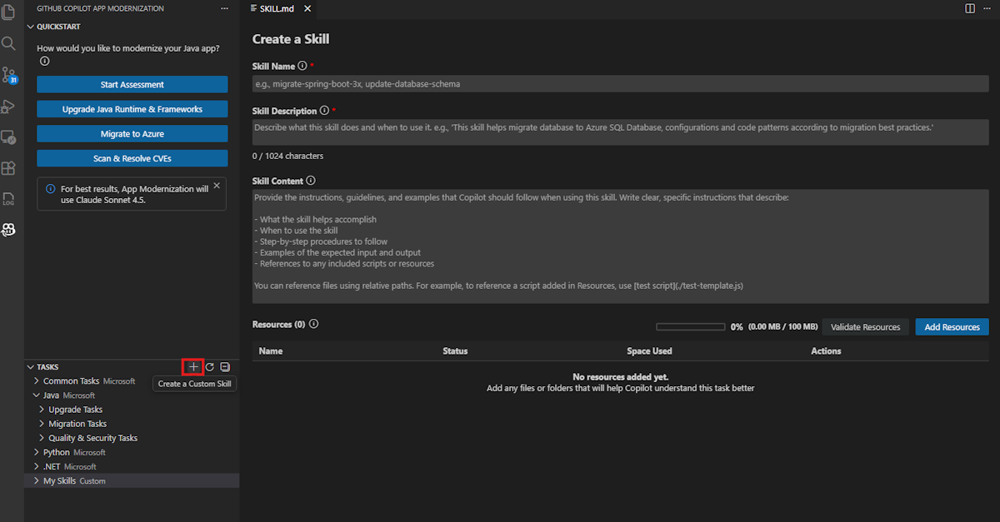
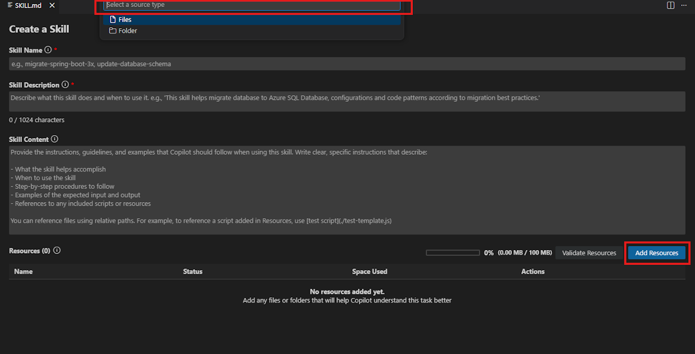
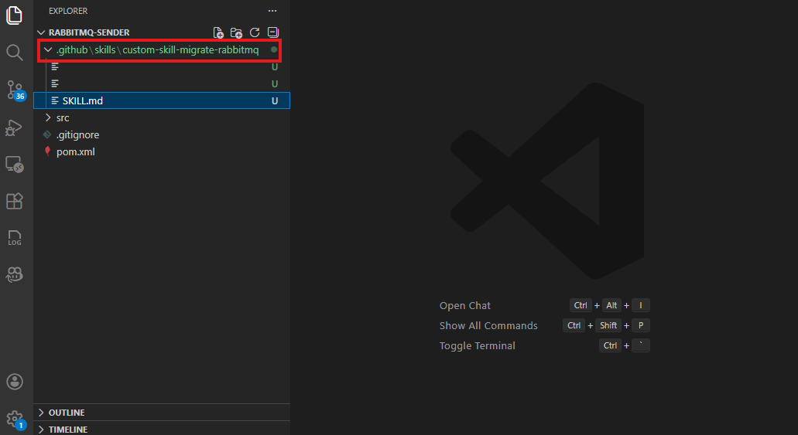
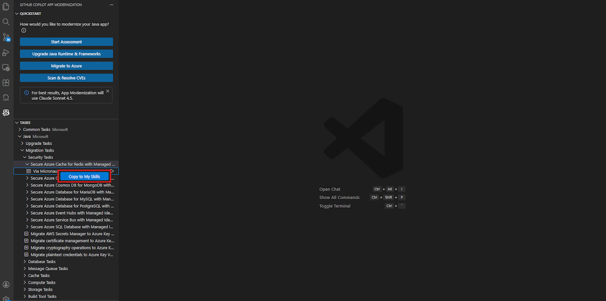

# Exercise 08 — Create and Apply a Custom Skill for the Sample Project *(Optional)*

**Duration**: 15 minutes
**Copilot Feature**: GitHub Copilot Modernization — Custom Skills (VS Code extension)
**Goal**: Create a project-specific custom skill for the `uportal-messaging` sample, apply it via Agent Mode, and share it with your team — all without writing any code or instructions yourself.

> ⚠️ **VS Code only**: The Custom Skills UI (`My Skills`) is not supported in IntelliJ IDEA.

---

## Background

So far in this workshop, every upgrade has used **Microsoft's predefined tasks** — generic skills maintained by Microsoft for common JDK/Spring Boot upgrade paths. While those cover the standard cases well, real projects often have team-specific migration patterns: custom library replacements, enforcement of internal coding standards, or migration from one service provider to another.

**Custom Skills** solve this by letting you codify your team's knowledge into a reusable `SKILL.md` file stored directly in `.github/skills/<skill-name>/` inside the project. Anyone with access to the repository can discover, run, and improve the skill. When applied, the skill opens Copilot Agent Mode and runs the full upgrade pipeline — plan, branch, migrate, validate (build + CVE + consistency + unit tests), and summary — exactly like a predefined task, but driven by your own instructions.

The `uportal-messaging` Maven sample is a Spring Boot messaging application. A natural and realistic skill for this project is migrating its messaging layer to Azure Service Bus — the same pattern that is directly documented on Microsoft Learn.

---

## Step 1 — Generate a Migration Reference Guide

Before creating the skill, use Copilot Chat to generate a brief migration guide that the skill will reference. This file becomes the **resource** attached to the skill.

Open Copilot Chat (`Ctrl+Alt+I`) and copy and paste the following prompt:

```
I have a Spring Boot Maven project at github.com/UW-Madison-DoIT/uportal-messaging that uses
RabbitMQ for messaging. Generate a concise migration guide (as markdown) covering:
1. Maven dependency changes: remove spring-boot-starter-amqp, add azure-spring-boot-starter-servicebus-jms
2. Configuration changes: replace spring.rabbitmq.* properties in application.properties with
   spring.jms.servicebus.* Azure Service Bus connection string and pricing-tier settings
3. Code changes: replace @RabbitListener with @JmsListener, replace RabbitTemplate with JmsTemplate
4. Notes on connection factory bean registration for Azure Service Bus JMS

Save the output as a file named guide.md in the project root.
```

> **Tip**: After Copilot generates the content, confirm "Keep" in the chat window to save `guide.md` to the project root.

---

## Step 2 — Create the Custom Skill

1. In the Activity sidebar, open the **GitHub Copilot modernization** extension pane (the rocket icon)
2. Hover over the **TASKS** section header — a **Create a Custom Skill** button (pencil icon) appears
3. Select **Create a Custom Skill**

   

4. A `SKILL.md` editor opens. Fill in the three fields:

   | Field | Value to enter |
   |-------|----------------|
   | **Skill Name** | `Custom-skill-migrate-rabbitmq` |
   | **Skill Description** | `Migrate RabbitMQ messaging to Azure Service Bus for Spring Boot applications` |
   | **Skill Content** | `You are a Spring Boot developer assistant. Follow 'guide.md' to migrate the messaging layer from RabbitMQ (spring-boot-starter-amqp) to Azure Service Bus JMS (azure-spring-boot-starter-servicebus-jms). Update pom.xml dependencies, replace spring.rabbitmq.* properties with spring.jms.servicebus.* settings, replace @RabbitListener with @JmsListener, and replace RabbitTemplate with JmsTemplate throughout the codebase. Validate the build, run unit tests, and generate a summary.` |

---

## Step 3 — Add the Reference Guide as a Resource

1. Select **Add Resources** below the Skill Content field

   

2. Choose **Files** from the resource type options
3. Navigate to and select `guide.md` from the project root
4. The extension copies `guide.md` into `.github/skills/Custom-skill-migrate-rabbitmq/` alongside the `SKILL.md`

> **Tip**: Verify the Resources section in `SKILL.md` now contains a link entry like: `- file:///guide.md`. This tells Copilot to use this file as reference knowledge during migration.

---

## Step 4 — Save the Skill

Select **Save** at the top of the `SKILL.md` editor.

The skill `Custom-skill-migrate-rabbitmq` now appears under the **My Skills** section in the TASKS panel.

> **Tip**: You can verify the skill folder was created by checking `.github/skills/Custom-skill-migrate-rabbitmq/` in VS Code Explorer — it should contain both `SKILL.md` and `guide.md`.

---

## Step 5 — Apply the Skill

1. In the **My Skills** section, locate `Custom-skill-migrate-rabbitmq`
2. Select **Run Skill**
3. The Copilot chat opens in **Agent Mode** and automatically:
   - a. Creates `plan.md` and `progress.md` in the project
   - b. Checks out a new migration branch (e.g., `migration/rabbitmq-to-azure-servicebus`)
   - c. Performs the messaging layer migration using `guide.md` as reference
   - d. Runs validations: build → unit tests → CVE → consistency → completeness
   - e. Generates `summary.md`

   If the agent pauses and asks for confirmation, copy and paste:

   ```
   Continue
   ```

4. Once all steps finish, select **Keep** in the chat window to confirm the changes

---

## Step 6 — Share the Skill with Your Team *(optional)*

Custom skills are portable — share yours with any team member who clones the same or a similar project.

1. In VS Code Explorer, locate `.github/skills/Custom-skill-migrate-rabbitmq/`
2. Copy the entire folder

   

3. The recipient places the folder under `.github/skills/` in their project root (creating the directory if needed)
4. They select **Refresh** in the GitHub Copilot modernization pane — the skill appears in their **My Skills** section immediately

> **Tip**: Committing `.github/skills/` to version control is the easiest way to share skills across the whole team — everyone gets the skill on pull.

---

## (Bonus) Customize a Microsoft Task

If you want to adapt an existing Microsoft task instead of starting from scratch:

1. In the **TASKS** section, right-click any Microsoft task (e.g., **Upgrade to Java 21**)
2. Select **Copy to My Skills**

   

3. A prefilled `SKILL.md` opens — edit the Name, Description, Content, and Resources to add project-specific rules
4. Select **Save** — the customized skill appears in **My Skills**

Copy and paste the following prompt into the chat to ask Copilot to suggest project-specific additions:

```
Looking at the pom.xml and source files in this workspace, what project-specific
migration rules or exceptions should I add to a custom skill that upgrades this
project to Java 21 and Spring Boot 3.x? List concrete pom.xml dependency changes
and code patterns that differ from the standard upgrade path.
```

---

## Verify

- [ ] `guide.md` exists in the project root with RabbitMQ → Azure Service Bus migration steps
- [ ] `.github/skills/Custom-skill-migrate-rabbitmq/SKILL.md` exists with correct Name, Description, and Content fields
- [ ] `.github/skills/Custom-skill-migrate-rabbitmq/guide.md` exists (resource copied by extension)
- [ ] `Custom-skill-migrate-rabbitmq` appears under **My Skills** in the GitHub Copilot modernization pane
- [ ] Agent Mode ran and produced `plan.md`, `progress.md`, and `summary.md`
- [ ] Migration branch was created in version control

---

## Key Takeaways

> Custom skills let you encode team-specific migration patterns into a reusable, shareable artifact stored in version control — transforming one-off Copilot sessions into repeatable, organization-wide modernization workflows.

---

<!-- Instructor Guide: The guide.md generation in Step 1 is intentionally done via a Copilot prompt — participants should not write the guide manually. If time is short, skip the Bonus step. Emphasise that committing .github/skills/ to the repo is the zero-friction sharing mechanism. The skill works on any Spring Boot Maven project with RabbitMQ — not just uportal-messaging. -->
